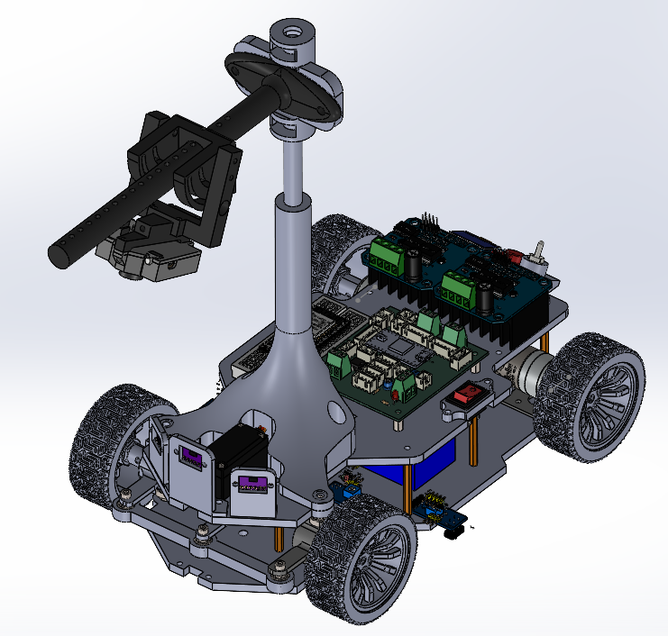
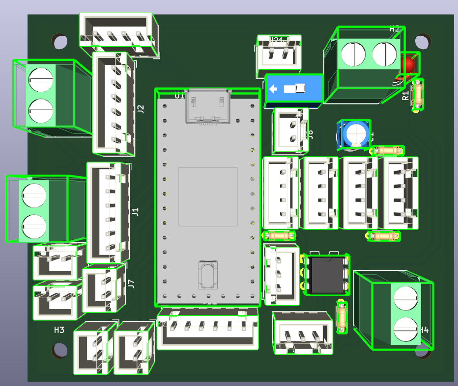

# NXP Cup Racing Car

## Overview

The car uses an onboard smart camera to detect track lines, a custom PCB centered on a Teensy 4.1 microcontroller to run the real-time control loops, and a set of IR/ToF sensors for start-line detection and obstacle stopping. This README covers the **mechanical design** and **electronic architecture** of the vehicle.

## Mechanical Design

- Chassis and all mechanical supports designed and modeled in **SolidWorks**.
- **Ackermann steering mechanism**: an **MG996R servo** mounted centrally on the front axle drives both front wheels via a linkage (biellette), so the wheels trace concentric circles in a turn — no lateral scrub.
- **Camera mast**: a raised mount holding the Pixy2 camera for a forward, elevated view of the track.
- **HMI mount**: a dedicated 3D-printed support integrating the OLED display and 2 push buttons.
- Front bumper design integrates 4 IR sensors symmetrically plus a centered ToF sensor.
- Parts were 3D printed; most structural parts in PLA.

## Electronic Architecture

### System Layers

The system is organized in three functional layers around the Teensy 4.1:

- **Perception:** Pixy2 camera (line detection), 4× IR sensors (start/finish line), ToF sensor (obstacle distance)
- **Processing:** Teensy 4.1 — runs two parallel PID loops (steering and speed)
- **Actuation:** MG996R servo (steering), DC motor via H-bridge (propulsion)

### Microcontroller — Teensy 4.1

- ARM Cortex-M7 @ 600 MHz, hardware floating-point unit, 1 MB RAM
- Arduino-compatible, multiple SPI/I²C/UART buses, independent PWM timers
- 35.6 × 17.8 mm footprint, 3.3 V logic level (matches all sensors used)

### Human-Machine Interface (HMI)

- 0.96" OLED display — shows live PID gains and system state
- 2 push buttons — mode selection and race start

### Components Summary

| Component | Reference | Role | Interface |
|---|---|---|---|
| Microcontroller | Teensy 4.1 | Central processing | — |
| Camera | Pixy2 v2 | Line detection | SPI |
| IR sensors | TCRT5000 × 4 | Start/finish line | GPIO |
| ToF sensor | VL53L0X | Obstacle stop | I²C |
| Steering servo | MG996R | Wheel steering | PWM |
| Drive motor | Brushed DC motor | Propulsion | PWM + H-bridge |
| Display | 0.96" OLED | Status display | I²C |
| Buttons | Push button × 2 | Mode selection/Race start | GPIO |
| Wheel encoders | Quadrature, 408 CPR | Speed/position feedback | GPIO (interrupt) |
| Power source | 3S LiPo (12.6 V) | Energy source | — |

### Pinout (Teensy 4.1)

| Pin | Peripheral | Signal | Interface |
|---|---|---|---|
| 12 | Pixy2 Camera | SPI RX (MISO) | SPI0 |
| 11 | Pixy2 Camera | SPI TX (MOSI) | SPI0 |
| 13 | Pixy2 Camera | SPI SCK | SPI0 |
| 10 | Pixy2 Camera | SPI CS | SPI0 |
| 18 | VL53L0X / OLED | I²C SDA | I²C0 |
| 19 | VL53L0X / OLED | I²C SCL | I²C0 |
| 17 | MG996R Servo | PWM | PWM |
| 6-7-22-23 | IBTs | PWM (speed) | PWM |
| 14–17 | IR sensors 1–4 | Start line | GPIO (pull-up) |
| 2-3-4-5 | Rotary encoder | CH A/B | GPIO (interrupt) |
| 8 | Mode button | SW | GPIO |
| 9 | Start button | SW | GPIO |

## Photos

## Repository Contents

- CAD files (chassis, camera mast, steering mechanism, HMI mount)
- PCB design files (KiCad project)
- 3D-printable part files

